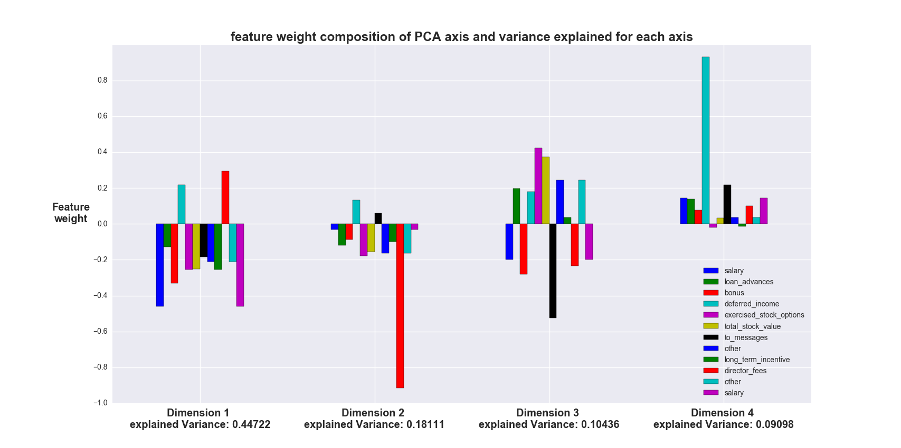

---
title:
- Project Machine Learning

author:
- Aurélien Gau

date:
- 24.01.2018
...

# Project Machine Learning

This project has been done using the python2.7 found in the ubuntu repository, the version of sklearn used are the 16.1.
Some link used as references can be found in the bibliography file.
The number represent the different questions asked. The project code can be found in the file poi_id.py.

## Question 1:

The goal of this project is to use email and financial data from the Enron dataset to try to identify person that may have been doing financial fraud. The dataset consist of financial data on the people working in the Enron company at the time of the scandal, of email exchanges between the employees and a classification of person as being probably fraudulent or not. The Enron company was a really important U.S. company in the 90's that was the origin of a scandal when it was discovered that it was the origin of massive financial faud. Because of the variety and dimensionality of the data, and the fact that we are trying to solve a classification problem on a large scale, a machine learning algorithm can be of great help to accelerate the first steps of identifiction of person that could be of interrest to investigate further.

The original dataset contains 146 values with 18 person of interest. The dataset originally contains 21 variables, some of them will not be used in the final model for performance reason.

Looking at the dataset, we see some variable with wide ranges like salary (0 to 1111258) or exercised_stock_option (0 to 30766064), we also see variables with negative values when they shouldn't according to the insider pay document. After investigating the negatives values problem, we found that the data of one employee had been falsy inputed and are shifted in other columns. I created the function `correctRobert` to take care of replacing the data in the feature they belongs to. Then I decided to remove outlier by using PCA to aggregate the features and finding extreme values by plotting the different value in different axis. Because PCA find components by combining features to represent the variablity of the dataset, I decided to standardize the data to have a better representation of all the variables in the different Axis. One problem That could occur, if we hadn't done that, would be that variable with really large values (like salary) would be "dominating" the variance in each axis of the PCA and thus masking the outliers potentially present in other variables with smaller values (like "expenses"). By doing so, i found that there was a datapoint named "Total" that was wrongly incorporated into the dataset from the insider pay document. I made sure that no poi were removed. Plotting the projected datapoints onto different axis doesn't show obvious outliers.

## Question 2:

By looking at financial data, I found that they were really skewed, there was lots of "small" values and a few very large value. But the very large value were several order larger than the majority of datapoints. I attempted to create variables making the separation of poi in the lower range of value easyer by creating log-transformed value of the positive financiary values.The variable tried where:
- log(salary)
- log(total_stock_value)
- log(total_payments)
Another try at creating interresting feature, was through the creation of several feature representing ratio between  different financiary features. As the Enron scandal was a financial fraud scandal, I thought we could find trend and interresting relation using ratio between financial features. The variables created were: 
- defe/paym
- bonus/salary
- bonus/paym
- ex_st_opt/tot_sto

The feature selection process was done in two steps. The first one was to decide to standardize the data, then concatenatethe result of a PCA and SelectKBest with the ANOVA-F classifier (f_classif parameters). The goal by doing so was to reduce the number of feature and to use the best feature to compensate the loss of information done during the PCA steps. I only used the "best" feature because the information the PCA would give would include part of the less informative features. The number of feature and component taken from the SelectKBest and PCA was evaluated using a GridSearchCV to find the best combination of n_component, k features and algorithm. By looking at the variance explained by each component of the anova, it was decided to only test 1 to 5 component in the GridSearch. 

After deciding that, it was decided To evaluate algorithm on the maximum of features possible throught gridSearch to evaluate the best performing algorithm (best performing algorithm will be described in the next section). Once the algorithm found it was decided to make a recursive feature elimination and cross-validation to try reduce the number of features originaly used in the PCA and the SelectKBest feature selection part of the pipeline tested without loosing information. The created features were also tested during the recursive feature elimination. because of their impact on the score (adding the feature gave model with lower F1 score than model without it) they weren't used in the final project.
After the recursive feature elimination during a hand-checking of the featureset obtain, it was found that having the 'salary' and 'other' variable doubled in the featurest increased the model results.
The features "from_poi_to_this_person", "from_this_person_to_poi" and "shared_receipt_with_poi" weren't used in the project because they supose to know who the poi are to create them and for me the objectives where to identify person that could be poi starting from available material, without prior knowledge of if someone is already a person of interest or not.

The features finally selected are:
  - salary
  - loan_advances
  - bonus
  - deffered_income
  - exercised_stock_options
  - total_stock_value
  - to_messages
  - other
  - long_term_incentive
  - director_fees
  - other
  - bonus
These features are standardized, fed into a PCA to transform data on several axis, these transofrmed data are then concatenated with the k-best (according to ANOVA-F test) of the original features, to feed the classification algorithm.

I performed feature scaling before the PCA step, Standardizing before PCA is recommended as PCA tries to maximize the variance over component. Without scaling the one feature with a different scale could impact the axis composition exessively. Naïve Bayes algorithm don't need feature scaling as it is not using Euclidian distance and thus doesn't need feature scaling.

## Question 3:

The algorithm tested was a pipeline combining sequencially different action on the dataset. The different action used are (in order):
    1. rescaling of the features
    2. concatenation of N component transformation and K best features (f_classif algorithm)
    3. classification algorithm on the features obtain at step 2.

 Several algorithm where tried during the model selection: Adaboost, RandomForest, Naive Bayes and SVM. The models where evaluated with their F1 score wich was chosen because it represent both recall and precision scores. Precision and Recall were also calculated and looked at during the selection process. The parameter tuning was done using a gridSearch algorithm to find a good score to compare the algorithms. Algorithm were also evaluated on their relative "speed". SVM algorithm were quickly rejected because of their computational time and not having scores compensating for its slowliness. Adaboost and RandomForest showed similar scores, but Naive Bayes gave better results overall. The validation and scoring was done using a stratified shuffle split with 200 repetition. This way of crossvalidating allowed for a stronger test of the algorithm, as stated in the starter code, this algorithm is also the one used by the tester.py script. By using this algorithm I test the different algorithm 200 train/test sets, the shuffling allows to compensate on the relative low numbers of datapoints. I locked the random state on the same value for every algorithm in order to compare performance of algorithm on the same datasets. The 200 repetition was chosen to balance the time required to obtain a score, and the stability of the score found.

In the end, the model found was a naive bayes computed on a 4 component PCA and the 7 best features obtained with a selectKBest using ANOVA-F testing. The KBest features found and their respective F-scores are:
    1. exercised_stock_options, 25.0977
    2. total_stock_value,       24.4662
    3. bonus,                   21.0600
    4. salary,                  18.5757
    5. salary,                  18.5757
    6. deferred_income,         11.5619
    7. long_term_incentive,     10.7245
   
The PCA axis composition and the variance explained by each axis is shown in the  visualization, and can be seen in the png: Axis_PCA.png.
.
Once the features and algorithm selected, the grid search and stratified shuffle split was done with a number of repetition equal and superior (different tests where done) to 1000 (1000, 1500, 2000). This last test was done to find the model offering the best F1 score possible in different situations.

## Question 4:

Tuning parameters of an algorithm means making modification to some constant, changing mathematical model... To make the model change its behaviour and try to obtain better results with the same original dataset. If an algorithm is used with wrong parameter it would perform badly compared to the same algorithm with good parameters. The classification algorithm used in the end model (Naive Bayes) doesn't have parameter selection option but the PCA number of components and Select K Best algorithm used to feed the model have been tested with different values for N components and K best features. Also during the algorithm selection process, different parameters were tuned for the different algorithms. For example for the adaboost classifier algorithm, the parameter tuned were the number of estimator and the learning rate of the algorithm. 

## Question 5:

Validation is the process of testing and evalutating a model. A classic mistake is to train and test the model on the same dataset or to test a model on part of it's training data. In that case we are evaluating an overfitted model. The separation of training and testing dataset ensure a better test and reduced risk of overfitting. Validation is really important to asses the model performance.
The method I used was a stratified shuffle split cross validation with varying number of repetition (200 to compare the different models, 1000 and more to test the chosen algorithm with different parameters and features). This methods allows to train and test the algorithm on N randomly chosen train/test datasets from the original dataset, and then to average the score of the algorithm. This gives a more reliable evaluation of the model performances. 

## Question 6:

The evaluation used are F1, recal and precision. The F1 score is a synthetic score representing recall and precision. My algorithm evaluated with a 1000 repetition of the stratified schuffle split gives:
     - F1 = 0.38397 
     - recall = 0.3745
     - Precision = 0.44998
The recall represent the proportion of person of interest classified as person of interest.
The precision represent the proportion of person of interet prediction that are person of interest in reality.
Those scores mean that approximately 45% of the person of interest prediction are person of interest and they represent approximately 38% of all the person of interest we could find in the dataset.
It also means that 62% of the person of interest are not found by the algorithm and we have 55% of the positive classification that are false positive.
